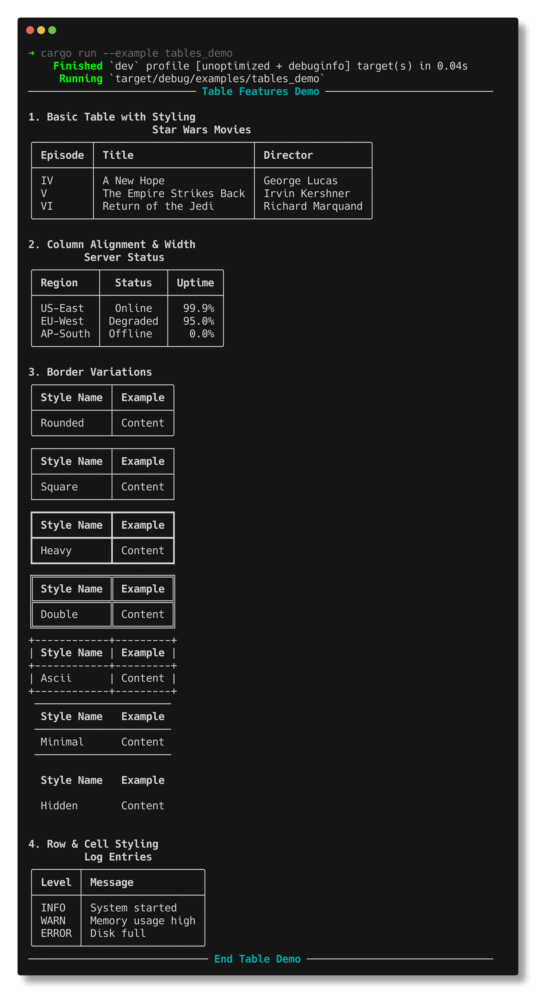
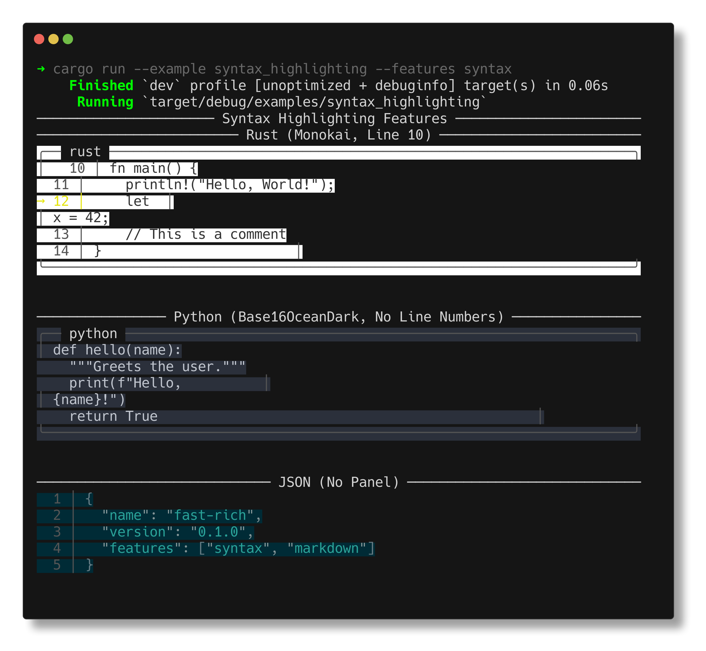
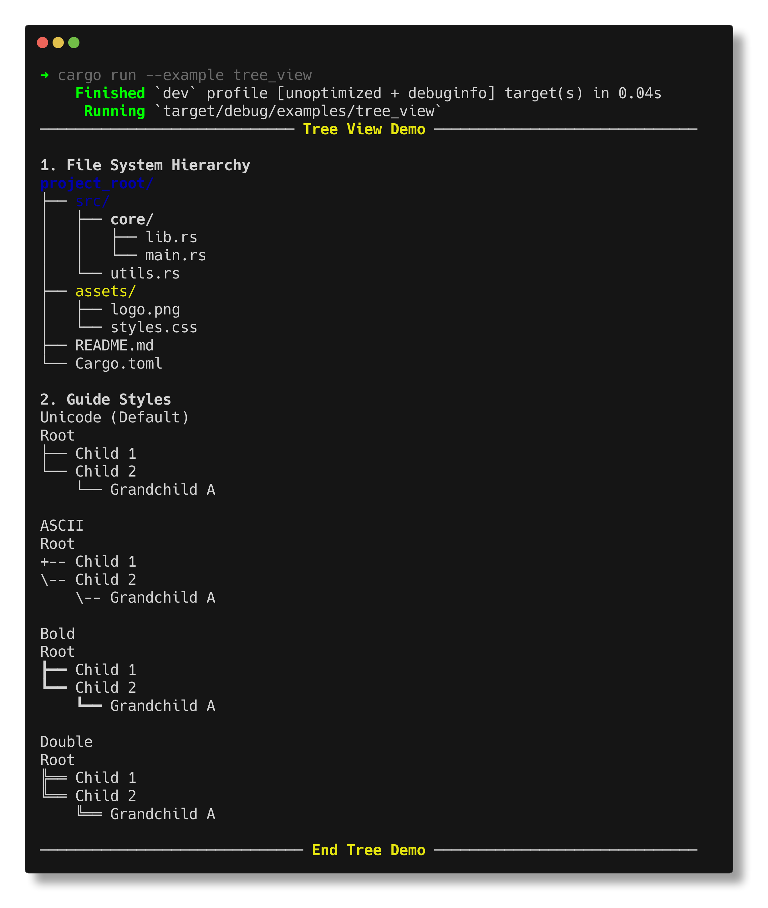
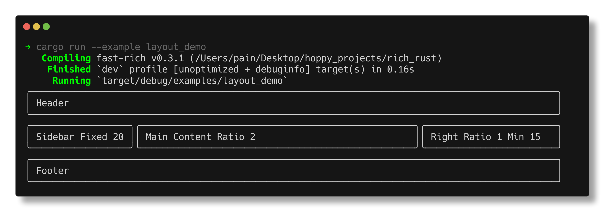

<div align="center">
  

  <h1>Fast-Rich</h1>

  [](https://mohammad-albarham.github.io/fast-rich)
  [](https://crates.io/crates/fast-rich)
  [](https://docs.rs/fast-rich)
  [](https://github.com/mohammad-albarham/fast-rich/blob/main/LICENSE)
  [](https://github.com/mohammad-albarham/fast-rich/actions)
  

  **High-performance Rust port of Python's popular [Rich](https://github.com/Textualize/rich) library.**
  
  *Beautiful terminal formatting for Rust applications.*

  
</div>

---

> [!IMPORTANT]
> This project is currently in **Alpha**. APIs are subject to change, and some features may be incomplete.

Fast-Rich empowers your terminal applications with rich text, tables, syntax highlighting, markdown rendering, and more, all with an idiomatic and safe Rust API.

## Feature Showcase

Experience the library's breadth with our automated demonstration:


---

## 🎨 Professional Assets

### 📊 Beautiful Tables
Unicode borders, automatic column alignment, and smart wrapping.



### 💻 Syntax Highlighting
Full support for various themes and languages via `syntect`.



### ⏳ Progress Bars
Multi-threaded tracking with spinners, ETAs, and customizable columns.


### 📈 Live Dashboards
Flicker-free, auto-updating content for real-time monitoring.


### 🌳 Structural Views
Render hierarchical data and layouts with ease.

<div align="center">
  
  
</div>

## Key Features

- **Rich Text**: Use styled text with bold, italic, underline, and RGB/TrueColor support.
- **Markdown Rendering**: Render headers, lists, and code blocks directly in your terminal.
- **Beautiful Logging**: Structured, colored, and timestamped logging compatible with the `log` crate.
  
- **Extensible API**: Create your own renderables and custom style themes.

## Installation

Add `fast-rich` to your `Cargo.toml`:

```toml
[dependencies]
fast-rich = "0.3.2"
```

To enable all features (including Syntax Highlighting and Markdown, which bring in extra dependencies):

```toml
[dependencies]
fast-rich = { version = "0.3.2", features = ["full"] }
```

Or pick specific features:

```toml
[dependencies]
fast-rich = { version = "0.3.2", features = ["syntax", "markdown", "logging"] }
```

## Quick Start

```rust
use fast_rich::prelude::*;

fn main() {
    let console = Console::new();

    // Styled text using markup
    console.print("[bold red]Hello[/] [blue]World[/]!");

    // Create a table
    let mut table = Table::new();
    table.add_column("Features");
    table.add_column("Status");
    table.add_row_strs(&["Rich Text", "✅ Ready"]);
    table.add_row_strs(&["Tables", "✅ Ready"]);
    
    // Render the table
    console.print_renderable(&table);
}
```

## 📚 Documentation

Detailed guides and API references are available at our official documentation site:

👉 **[mohammad-albarham.github.io/fast-rich](https://mohammad-albarham.github.io/fast-rich)**

### Essential Resources
- **[Getting Started](https://mohammad-albarham.github.io/fast-rich/getting-started)**: Installation, first steps, and core concepts.
- **[User Guides](https://mohammad-albarham.github.io/fast-rich/guides)**: Deep dives into Tables, Progress Bars, Live Display, and more.
- **[API Reference](https://docs.rs/fast-rich)**: Comprehensive technical documentation on `docs.rs`.
- **[Examples](https://github.com/mohammad-albarham/fast-rich/tree/main/examples)**: Real-world code samples for every feature.

## Examples

Run the included examples to see features in action:

```bash
# Core features
cargo run --example showcase
cargo run --example hero

# Print macros (drop-in replacement for std::print!)
cargo run --example print_shadowing

# Progress bars and spinners
cargo run --example progress_rich
cargo run --example spinner_column_demo
cargo run --example all_spinners_demo

# Other features
cargo run --example syntax_highlighting --features syntax
cargo run --example live_clock
cargo run --example logging --features logging
```

## Comparisons

| Feature | Python Rich | Fast-Rich |
|:--------|:------------|:----------|
| Rich Text | ✅ | ✅ |
| Tables | ✅ | ✅ |
| Progress | ✅ | ✅ |
| Live Display | ✅ | ✅ |
| Syntax Highlighting | ✅ | ✅ |
| Markdown | ✅ | ✅ |
| Layouts | ✅ | ✅ |
| Tracebacks | ✅ | ✅ |
| Inspect | ✅ | ✅ |

## Contributing

Contributions are welcome! Please check out [CONTRIBUTING.md](docs/CONTRIBUTING.md) for guidelines on how to get started.

## Contributors

<!-- ALL-CONTRIBUTORS-BADGE:START -->
[](https://github.com/mohammad-albarham/fast-rich/graphs/contributors)
<!-- ALL-CONTRIBUTORS-BADGE:END -->

Thanks to everyone who has contributed to Fast-Rich! 🙏

<a href="https://github.com/mohammad-albarham/fast-rich/graphs/contributors">
  
</a>

Special thanks to:
- Everyone who has [opened issues](https://github.com/mohammad-albarham/fast-rich/issues) to report bugs or request features
- All [pull request contributors](https://github.com/mohammad-albarham/fast-rich/pulls?q=is%3Apr+is%3Amerged) who helped improve the codebase
- The [Python Rich](https://github.com/Textualize/rich) team for the original inspiration

## License

MIT or Apache-2.0
