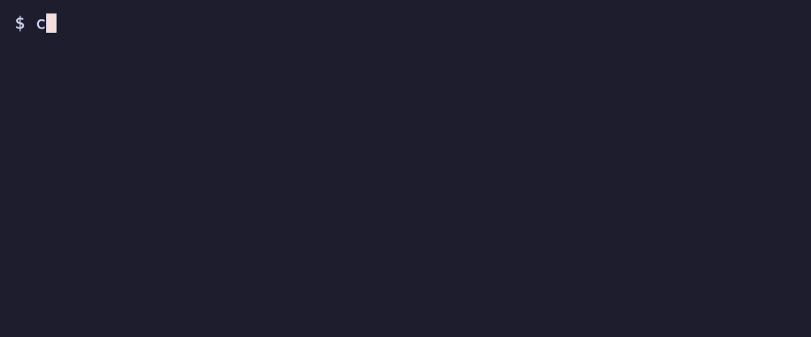

# Getting Started

This guide will help you get up and running with Fast-Rich in minutes.

## Installation

Add `fast-rich` to your `Cargo.toml`:

=== "Basic"

    ```toml
    [dependencies]
    fast-rich = "0.3.2"
    ```

=== "Full Features"

    ```toml
    [dependencies]
    fast-rich = { version = "0.3.2", features = ["full"] }
    ```

=== "Selective Features"

    ```toml
    [dependencies]
    fast-rich = { version = "0.3.2", features = ["syntax", "markdown", "logging"] }
    ```

### Available Features

| Feature | Description |
|:--------|:------------|
| `syntax` | Syntax highlighting for code (adds `syntect` dependency) |
| `markdown` | Markdown rendering (adds `pulldown-cmark` dependency) |
| `logging` | Integration with Rust's `log` crate |
| `full` | Enables all features above |

## Your First Program

!!! example "Fast-Rich in action"

    **Code**
    
    Create a new file `src/main.rs`:
    
    ```rust
    use fast_rich::prelude::*;

    fn main() {
        let console = Console::new().force_color(true);

        console.print("[bold cyan]Fast-Rich[/] - Beautiful terminal output for :crab: Rust programming language :crab:!\n");

        // Styled text
        console.print("[bold]Bold[/], [italic]italic[/], [red]colors[/], [underline]underline[/], [dim]dim[/], [reverse]reverse[/], [strike]strikethrough[/], emojis :rocket: :sparkling_heart:! and more!\n");
    }
    ```
    
    **Run it**
    
    ```bash
    cargo run
    ```
    
    **What you'll see**
    
    

## Drop-in Print Macros

Fast-Rich provides `print!` and `println!` macros that shadow the standard library versions, giving you styled output with zero friction:

```rust
// Shadow the standard library macros
use fast_rich::{print, println};

fn main() {
    // Works exactly like std::println!, but with rich markup!
    println!("[bold green]Success![/] All systems operational.");

    // Format arguments work as expected
    let name = "Alice";
    let score = 100;
    println!("[cyan]Player[/]: {} scored [yellow]{}[/] points", name, score);

    // Emoji support built-in
    println!(":rocket: Launch  :fire: Hot  :sparkles: Magic");
}
```

!!! tip "Raw Output for Untrusted Input"
    If your data might contain text that looks like markup tags (e.g., `[Red]`), use `println_raw!` to skip parsing:
    ```rust
    use fast_rich::println_raw;
    let user_data = get_untrusted_input();
    println_raw!("{}", user_data);  // Prints literally, no markup parsing
    ```

!!! info "More Print Macros"
    See the [Print Macros Guide](guides/print-macros.md) for `eprint!`, `eprintln!`, and edge case handling.

## Understanding the Console

The `Console` is your main entry point for all output. It handles:

- Terminal width detection
- Color capability detection
- Styled output rendering

```rust
use fast_rich::console::Console;

fn main() {
    let console = Console::new();
    
    console.rule("[bold magenta]Console API Demo[/]");
    console.print("This is a [bold]regular print[/].");
    console.newline();

    console.println("This is a [italic]println[/] which adds a newline.");

    console.rule("Padding");
    console.print_renderable(&fast_rich::text::Text::from("Explicit Renderable"));
    console.newline();

    // Demonstrate some emoji
    console.println("Emoji: :snake: :crab:");
}
```

**What you'll see:**



## Markup Syntax

Fast-Rich uses a simple markup syntax for inline styling:

```rust
use fast_rich::Console;

fn main() {
    let console = Console::new();

    console.println("[bold cyan]═══ Markup Demo ═══[/]\n");

    // Basic styles
    console.println("[bold]Bold[/]  [italic]Italic[/]  [underline]Underline[/]  [dim]Dim[/]");

    // Colors
    console.println("[red]Red[/]  [green]Green[/]  [blue]Blue[/]  [yellow]Yellow[/]  [magenta]Magenta[/]");

    // Background + combined
    console.println("[white on red] Alert [/]  [bold green]Success![/]  [italic cyan]Info[/]");

    // Emoji
    console.println("\n:rocket: Launch  :fire: Hot  :sparkles: Magic  :check_mark: Done");
}
```

**What you'll see:**


### Escape Markup

To display literal brackets, escape them:

```rust
console.print("Use \\[bold] to show [bold] literally");
```

## Printing Renderables

For complex objects like tables, panels, and trees, use `print_renderable`:

```rust
use fast_rich::prelude::*;

fn main() {
    let console = Console::new();

    console.println("[bold cyan]═══ Table Demo ═══[/]\n");

    let mut table = Table::new();
    table.add_column(Column::new("Name"));
    table.add_column(Column::new("Role"));
    table.add_column(Column::new("Status").center());

    table.add_row_strs(&["Alice", "Developer", "✓ Active"]);
    table.add_row_strs(&["Bob", "Designer", "✓ Active"]);
    table.add_row_strs(&["Charlie", "Manager", "Away"]);

    console.print_renderable(&table);
}
```

**What you'll see:**


## Progress Tracking
 
Fast-Rich provides production-grade progress bars with spinners, ETA, and transfer speed. 

```rust
use fast_rich::console::Console;
use fast_rich::progress::{
    BarColumn, DownloadColumn, FileSizeColumn, MofNColumn, PercentageColumn, Progress,
    SpinnerColumn, TextColumn, TimeRemainingColumn, TotalFileSizeColumn, TransferSpeedColumn,
};
use std::thread;
use std::time::Duration;

fn main() {
    let console = Console::new();
    
    // Create a progress bar with custom columns
    let mut progress = Progress::new()
        .with_console(Console::new())
        .with_columns(vec![
            Box::new(SpinnerColumn::new()),
            Box::new(TextColumn::new("[progress.description]")),
            Box::new(BarColumn::new(40)),
            Box::new(PercentageColumn::new()),
            Box::new(TransferSpeedColumn),
            Box::new(TimeRemainingColumn),
        ]);

    let task1 = progress.add_task("Downloading file1.zip", Some(100));
    let task2 = progress.add_task("Downloading file2.zip", Some(200));

    progress.start();

    // Update progress in your loop
    for _ in 0..100 {
        progress.update(task1, 1); // +1 by default or specify absolute value
        progress.advance(task2, 2);
        
        progress.refresh();
        thread::sleep(Duration::from_millis(50));
    }

    progress.stop();
}
```

**What you'll see (Full Feature Demo):**


!!! tip "More Examples"
    Check out `examples/progress_rich.rs` for more advanced usage including auto-refresh, context managers, and file transfer modes.

## Terminal Compatibility

Fast-Rich automatically detects terminal capabilities:

| Environment | Color Support |
|:------------|:--------------|
| Modern terminals (iTerm2, Windows Terminal, etc.) | Full RGB/Truecolor |
| Most Linux/macOS terminals | 256 colors |
| Basic terminals | 8/16 colors |
| CI/CD, pipes, redirects | Colors disabled |

!!! tip "Force Colors"
    To force color output (e.g., in CI):
    
    ```rust
    let console = Console::new().force_color(true);
    ```

## Next Steps

Now that you have the basics, explore the feature guides:

- **[Text & Styles](guides/text-styles.md)** - Deep dive into colors and styling
- **[Tables](guides/tables.md)** - Create beautiful data tables
- **[Progress Bars](guides/progress.md)** - Track long-running tasks
- **[Live Display](guides/live.md)** - Build dynamic dashboards

Or run the examples:

```bash
cargo run --example showcase --features full
```
