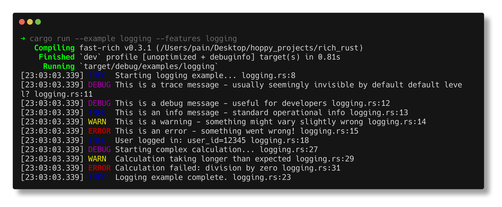

# Logging

Fast-Rich integrates with Rust's `log` crate to provide beautiful, colored, and structured logging output.

!!! note "Feature Flag Required"
    The logging handler requires the `logging` feature:
    ```toml
    fast-rich = { version = "0.2.0", features = ["logging"] }
    ```

## Quick Example

```rust
use fast_rich::log::RichLogger;
use log::{debug, error, info, warn};

fn main() {
    // Initialize the rich logger
    RichLogger::init().unwrap();
    
    info!("Application started");
    debug!("Loading configuration...");
    warn!("Cache is disabled");
    error!("Failed to connect to database");
}
```

**Output:**
```
[18:15:00.123] INFO  Application started main.rs:6
[18:15:00.124] DEBUG Loading configuration... main.rs:7
[18:15:00.124] WARN  Cache is disabled main.rs:8
[18:15:00.125] ERROR Failed to connect to database main.rs:9
```

---

## Setting Up

### Basic Initialization

```rust
use fast_rich::log::RichLogger;

fn main() {
    RichLogger::init().expect("Failed to initialize logger");
    
    // Now use log macros
    log::info!("Ready!");
}
```

### With Log Level

```rust
use fast_rich::log::RichLogger;
use log::LevelFilter;

fn main() {
    RichLogger::init_with_level(LevelFilter::Debug).unwrap();
    
    log::debug!("This will show");
    log::trace!("This won't show (below Debug level)");
}
```

---

## Log Levels

Each level has distinct colors for easy identification:

| Level | Color | Usage |
|:------|:------|:------|
| `TRACE` | Dim gray | Fine-grained debugging |
| `DEBUG` | Blue | Development debugging |
| `INFO` | Green | Normal operation |
| `WARN` | Yellow | Recoverable issues |
| `ERROR` | Red | Failures and errors |

---

## Output Format

Log output includes:

1. **Timestamp** - `[HH:MM:SS.mmm]`
2. **Level** - Colored log level
3. **Message** - Your log message
4. **Location** - File and line number

```
[18:15:00.123] INFO  User logged in: user_id=12345 auth.rs:42
```

---

## Structured Logging

Use structured logging for better debugging:

```rust
log::info!("Request processed: method={}, path={}, status={}", 
    "GET", "/api/users", 200);

log::error!("Database error: query={}, error={}", 
    "SELECT * FROM users", "connection timeout");
```

---

## Custom Configuration

Configure the logger with builder pattern:

```rust
use fast_rich::log::{RichLogger, RichLoggerConfig};
use log::LevelFilter;

fn main() {
    let config = RichLoggerConfig::new()
        .level(LevelFilter::Debug)
        .show_timestamp(true)
        .show_location(true);
    
    RichLogger::init_with_config(config).unwrap();
}
```

---

## Real Terminal Output

!!! example "Run the logging demo"

    **Command:**
    ```bash
    cargo run --example logging --features logging
    ```

    **What you'll see:**

    

---

## Integration Example

Complete application with structured logging:

```rust
use fast_rich::log::RichLogger;
use log::{debug, error, info, warn};

struct Server {
    port: u16,
}

impl Server {
    fn new(port: u16) -> Self {
        info!("Creating server on port {}", port);
        Self { port }
    }
    
    fn start(&self) {
        info!("Server starting on port {}", self.port);
        debug!("Binding to 0.0.0.0:{}", self.port);
        
        // Simulate some events
        info!("Server is ready to accept connections");
        warn!("TLS is not configured");
    }
    
    fn handle_request(&self, path: &str) {
        debug!("Handling request: path={}", path);
        
        if path == "/error" {
            error!("Request failed: path={}, reason=simulated error", path);
        } else {
            info!("Request completed: path={}, status=200", path);
        }
    }
}

fn main() {
    RichLogger::init().unwrap();
    
    let server = Server::new(8080);
    server.start();
    server.handle_request("/api/users");
    server.handle_request("/error");
}
```

---

## Tips

!!! tip "Use with Console"
    Rich logging doesn't interfere with Console output. You can use both:
    ```rust
    let console = Console::new();
    console.print_renderable(&table);
    
    log::info!("Table rendered successfully");
    ```

!!! tip "Environment Variables"
    Control log level via `RUST_LOG` environment variable:
    ```bash
    RUST_LOG=debug cargo run
    ```

!!! warning "Thread Safety"
    The RichLogger is thread-safe. Logs from multiple threads 
    will be properly serialized.
