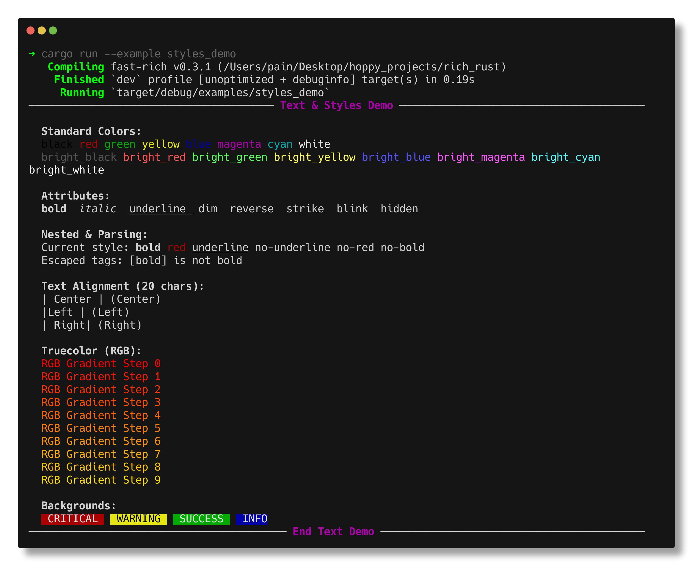

# Text & Styles

Fast-Rich provides a powerful text styling system with support for colors, attributes, and a convenient markup syntax.

## Quick Example

```rust
use fast_rich::prelude::*;

fn main() {
    let console = Console::new();
    
    console.print("[bold red]Error:[/] Something went wrong");
    console.print("[italic blue]Hint:[/] Check your configuration");
}
```

---

## Color System

Fast-Rich supports multiple color modes that adapt to terminal capabilities:

### Standard Colors (8 Colors)

The basic colors available on all terminals:

```rust
console.print("[black]black[/] [red]red[/] [green]green[/] [yellow]yellow[/]");
console.print("[blue]blue[/] [magenta]magenta[/] [cyan]cyan[/] [white]white[/]");
```

### Bright Colors (16 Colors)

Brighter variants available on most terminals:

```rust
console.print("[bright_red]bright_red[/] [bright_green]bright_green[/]");
console.print("[bright_blue]bright_blue[/] [bright_magenta]bright_magenta[/]");
```

### RGB/Truecolor (16 Million Colors)

For terminals with truecolor support:

```rust
console.print("[color(255,100,0)]Orange[/]");
console.print("[color(0,255,128)]Spring Green[/]");
console.print("[color(128,0,255)]Purple[/]");
```

### Background Colors

Use `on` to set background colors:

```rust
console.print("[white on blue] White text on blue background [/]");
console.print("[black on yellow] Warning style [/]");
console.print("[white on color(200,0,0)] Custom red background [/]");
```

---

## Style Attributes

Apply formatting effects to text:

| Attribute | Syntax | Description |
|:----------|:-------|:------------|
| Bold | `[bold]` | **Bold text** |
| Italic | `[italic]` | *Italic text* |
| Underline | `[underline]` | <u>Underlined text</u> |
| Strike | `[strike]` | ~~Strikethrough~~ |
| Dim | `[dim]` | Dimmed/faded text |
| Reverse | `[reverse]` | Swap foreground/background |
| Blink | `[blink]` | Blinking text (limited support) |

```rust
console.print("[bold]Bold[/] [italic]Italic[/] [underline]Underline[/]");
console.print("[strike]Strike[/] [dim]Dim[/] [reverse]Reverse[/]");
```

### Combining Styles

Combine multiple styles in one tag:

```rust
console.print("[bold italic red]Bold italic red text[/]");
console.print("[underline blue on white]Underlined blue on white[/]");
```

---

## Markup Syntax

### Basic Tags

Wrap text in `[style]...[/]` to apply styles:

```rust
console.print("[bold]This is bold[/]");
console.print("[red]This is red[/]");
```

### Nesting Styles

Styles can be nested:

```rust
console.print("[bold]Bold [italic]and italic[/italic] just bold[/]");
console.print("[red]Red [blue]with blue inside[/blue] back to red[/]");
```

### Negating Styles

Use `no-` prefix to remove a style:

```rust
console.print("[bold]Bold [no-bold]not bold[/no-bold] bold again[/]");
console.print("[red]Red [no-red]default color[/no-red] red again[/]");
```

### Escaping Brackets

To display literal brackets, use backslash:

```rust
console.print("Use \\[bold] to show [bold] literally");
// Output: Use [bold] to show [bold] literally
```

---

## The Style Struct

For programmatic styling, use the `Style` struct:

```rust
use fast_rich::prelude::*;

let style = Style::new()
    .foreground(Color::Red)
    .background(Color::White)
    .bold()
    .underline();

let text = Text::styled("Styled text", style);
console.print_renderable(&text);
```

### Style Builder Methods

| Method | Description |
|:-------|:------------|
| `.foreground(Color)` | Set text color |
| `.background(Color)` | Set background color |
| `.bold()` | Make text bold |
| `.italic()` | Make text italic |
| `.underline()` | Add underline |
| `.strike()` | Add strikethrough |
| `.dim()` | Make text dim |
| `.reverse()` | Swap fg/bg colors |

### Color Enum

```rust
use fast_rich::Color;

// Named colors
let red = Color::Red;
let bright_blue = Color::BrightBlue;

// RGB colors
let orange = Color::Rgb(255, 128, 0);

// 256-color palette
let color_123 = Color::Ansi256(123);
```

---

## Text Alignment

Align text within a specified width:

```rust
use fast_rich::prelude::*;

let left = Text::from("Left").alignment(Alignment::Left);
let center = Text::from("Center").alignment(Alignment::Center);
let right = Text::from("Right").alignment(Alignment::Right);

console.print_renderable(&left);
console.print_renderable(&center);
console.print_renderable(&right);
```

---

## Real Terminal Output

!!! example "Run the styles demo"

    **Command:**
    ```bash
    cargo run --example styles_demo
    ```

    **What you'll see:**

    
