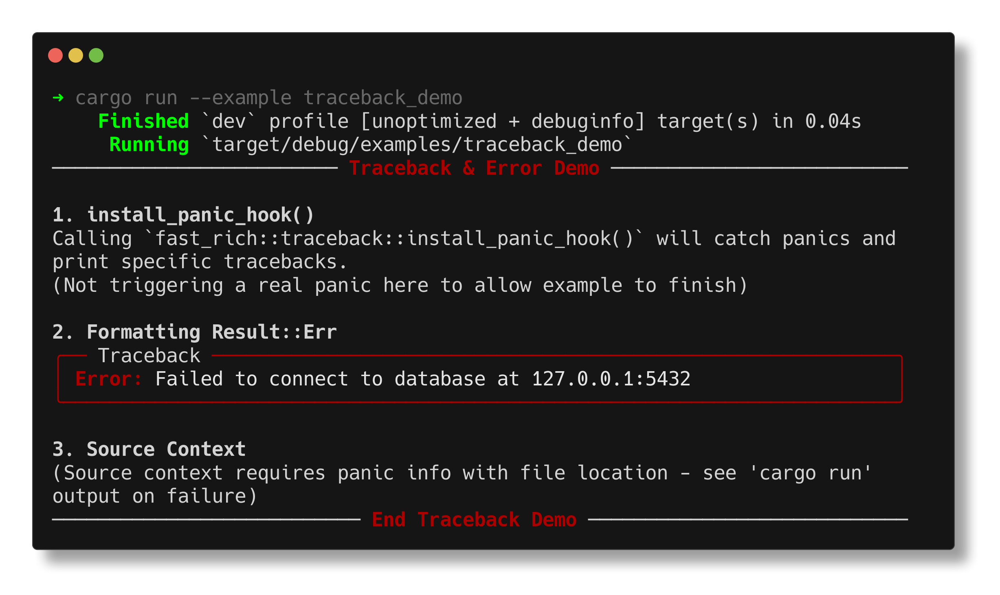

# Tracebacks

Fast-Rich provides beautiful error handling with pretty-printed tracebacks and panic handlers.

## Quick Example

```rust
use fast_rich::prelude::*;
use fast_rich::traceback::Traceback;

fn main() {
    let console = Console::new();
    
    let tb = Traceback::from_error("Connection timeout");
    console.print_renderable(&tb);
}
```

**Output:**
```
┏━━ Traceback ━━━━━━━━━━━━━━━━━━━━━━━━━━━━━━━━━━━━━━━━━━━━━━━━━━━┓
┃ Error: Connection timeout                                      ┃
┗━━━━━━━━━━━━━━━━━━━━━━━━━━━━━━━━━━━━━━━━━━━━━━━━━━━━━━━━━━━━━━━━┛
```

---

## Install Panic Hook

Replace Rust's default panic handler with a rich version:

```rust
use fast_rich::prelude::*;

fn main() {
    // Install the handler at the start of your program
    install_panic_hook();
    
    // Now panics will be beautifully formatted
    panic!("Something went terribly wrong!");
}
```

The panic hook provides:
- Colored error message
- Stack trace (when available)
- Source location

---

## Creating Tracebacks

### From Error Message

```rust
let tb = Traceback::from_error("Database connection failed");
```

### From Result Error

```rust
use std::fs::File;

fn read_config() -> Result<String, std::io::Error> {
    let file = File::open("config.json")?;
    // ...
    Ok(String::new())
}

fn main() {
    let console = Console::new();
    
    if let Err(e) = read_config() {
        let tb = Traceback::from_error(&format!("{}", e));
        console.print_renderable(&tb);
    }
}
```

---

## Configuration

Customize traceback display:

```rust
use fast_rich::traceback::{Traceback, TracebackConfig};

let config = TracebackConfig {
    show_source: true,       // Show source code
    show_locals: false,      // Show local variables (if available)
    max_frames: 20,          // Maximum stack frames
    ..Default::default()
};

let tb = Traceback::from_error("Error message")
    .with_config(config);
```

---

## Error Handling Pattern

Use tracebacks for user-friendly error reporting:

```rust
use fast_rich::prelude::*;
use fast_rich::traceback::Traceback;

fn main() {
    let console = Console::new();
    
    if let Err(e) = run_application() {
        // Show error in a nice format
        let tb = Traceback::from_error(&e.to_string());
        console.print_renderable(&tb);
        
        // Exit with error code
        std::process::exit(1);
    }
}

fn run_application() -> Result<(), Box<dyn std::error::Error>> {
    // Your application logic
    Err("Failed to initialize".into())
}
```

---

## Real Terminal Output

!!! example "Run the traceback demo"

    **Command:**
    ```bash
    cargo run --example traceback_demo
    ```

    **What you'll see:**

    

---

## Combining with Logging

Use tracebacks alongside the logging handler:

```rust
use fast_rich::log::RichLogger;
use fast_rich::traceback::Traceback;
use log::error;

fn main() {
    RichLogger::init().unwrap();
    
    if let Err(e) = risky_operation() {
        // Log the error
        error!("Operation failed: {}", e);
        
        // Also show a traceback for detailed info
        let console = Console::new();
        let tb = Traceback::from_error(&e.to_string());
        console.print_renderable(&tb);
    }
}
```

---

## Tips

!!! tip "Install Early"
    Install the panic hook at the very start of `main()`:
    ```rust
    fn main() {
        install_panic_hook();
        // ... rest of program
    }
    ```

!!! tip "Production vs Development"
    Consider different traceback configs for dev and production:
    ```rust
    let config = if cfg!(debug_assertions) {
        TracebackConfig { show_source: true, ..Default::default() }
    } else {
        TracebackConfig { show_source: false, ..Default::default() }
    };
    ```

!!! warning "Sensitive Information"
    Be careful about showing tracebacks to end users—they may 
    contain sensitive file paths or internal details.
